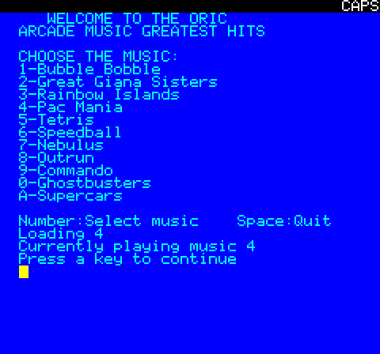

# MYM Music Player
Sample code demonstrating how to read the keyboard without using the code from the Oric system ROM.

# How to build
This code sample requires the [Oric SDK](https://osdk.org/index.php?page=download) to build.

Just run "osdk_build.bat" to compile it, and then "osdk_execute.bat" to launch it.

# How to use
After building and running the project, you should see the following UI:

Just press any key from 1 to A to select the corresponding music.

# Reasons
There are a few native Oric music editors, unfortunately they are not very well documented, and the music player routines require some long forgotten custom compiler magic, making them ill suited to be used in games or demos if you were not the original person who made these tools.

This is where the MYM format comes in: It allowed us to choose any of the thousands of Atari ST musics available in YM format and play them in the Oric.

# Limitations
The player is not particularly efficient, and every 256 played frames we encur a significant CPU hike, in addition to that it requires a number of temporary buffers making it also quite inneficient memory wise.

# Authors
This code is the result of a cooperation between multiple people.
- Marq for the original development of the MYM format for the MSX computers
- Mickaël Pointier (Dbug) for the Oric version

# Additional information
You can find more information on the topic in various places:
- [VIA and AK-3-8912](https://wiki.defence-force.org/doku.php?id=oric:hardware:sound) on the Defence Force wiki
- [Let's make noise article](https://osdk.org/index.php?page=articles&ref=ART5) in the OSDK articles section
